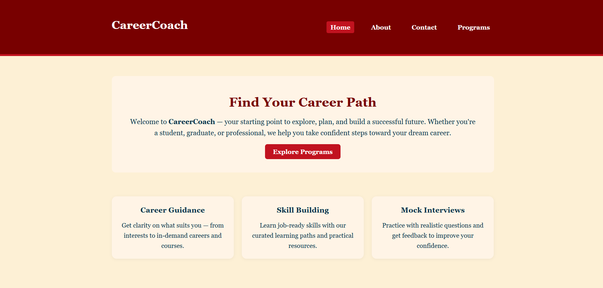
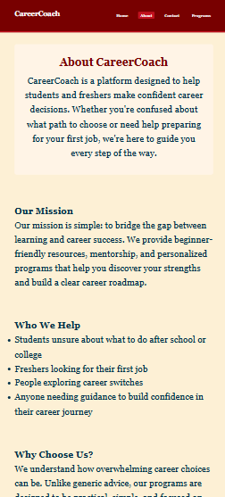

# task6

CareerCoach
A clean, multi-page static website built using HTML and CSS. The project demonstrates real-world best practices such as layout consistency across pages, reusable CSS styles, and modular structuring, maintaining a unified design and smooth navigation between pages.

---

# Live Demo

[🔗 View Live](https://lisha2804.github.io/task6/)

---

# Screenshots

### Desktop View

### Mobile View

---

